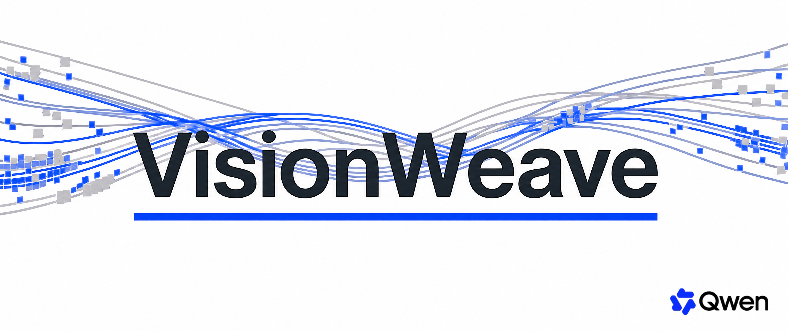
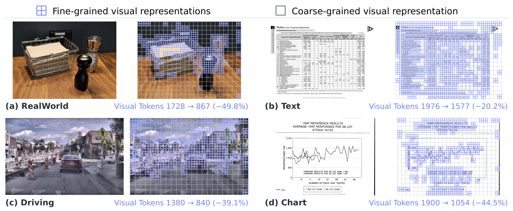
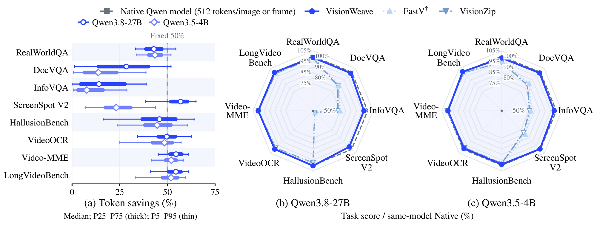
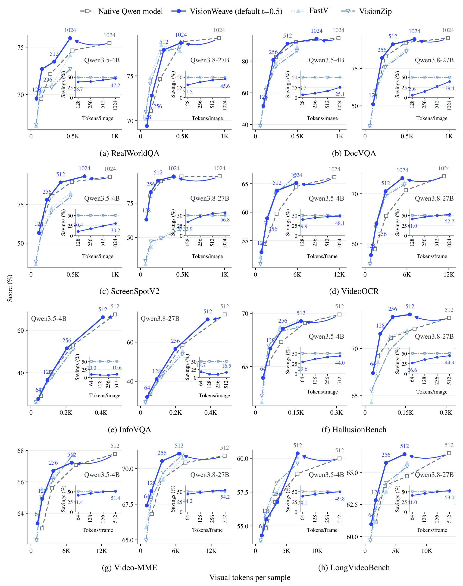

<p align="center">
  
</p>
<!--  -->


###  Weaving Elastic Visual Representations as a Native Capability of MLLMs

[](https://arxiv.org/abs/2610.07987)
[](paper/2610.07987v1.pdf)

**Contents:** [Overview](#overview) · [Results](#results) · [Usage](#usage) · [Agent Setup](#agent-assisted-setup) · [Citation](#citation)

## Overview

VisionWeave learns **where to preserve visual detail and where to compress**, weaving fine- and coarse-grained representations according to visual content. 

Watch the [quick walkthrough video](assets/demo.mp4).

<p align="center">
  
  <br>
  <em>Fine detail where it matters, compact representations elsewhere. Figure 1 from the paper.</em>
</p>

## Performance

### Content-adaptive token savings

<p align="center">
  
  <br>
  <strong>43.0% visual token savings · 98.9% native performance retained · Qwen3.8-27B averages across eight benchmarks</strong><br>
  <em><br>
  </em>
</p>

### Across tasks and input resolutions

<p align="center">
  <a href="assets/resolution_tradeoffs.png"></a>
  <br>
  <em>Consistently favorable efficiency–quality trade-offs across tasks and input resolutions.</em>
</p>

### SGLang serving efficiency

Qwen3.8-27B on LongVideoBench, 2 × A100-80GB (BF16, TP=2).

| Metric | Native | VisionWeave | Improvement |
| --- | ---: | ---: | ---: |
| Throughput (requests/min) ↑ | 0.90 | **2.07** | **2.30×** |
| Mean TTFT (s) ↓ | 169.90 | **77.54** | **54.4% lower** |
| P95 TTFT (s) ↓ | 281.41 | **120.59** | **57.1% lower** |
| Mean TPOT (ms) ↓ | 355.64 | **140.29** | **60.6% lower** |
| P95 TPOT (ms) ↓ | 715.58 | **289.19** | **59.6% lower** |

## Usage

This release provides image/video inference for **dense Qwen3.5**. Trained checkpoints are supplied separately.

```bash
git clone https://github.com/FFY0/VisionWeave.git
cd VisionWeave
```

### Agent-assisted setup (Strong Recommendation)

Open this checkout in your coding agent and use the bundled [VisionWeave skill](.agents/skills/visionweave-setup/SKILL.md):

```text
Read .agents/skills/visionweave-setup/SKILL.md and configure this repository's
Python environment in .venv. Preserve the pinned SGLang revision and
requirements-lock.txt, verify the installed source, and run the environment
checks. Report the environment path, any local adaptations, and check results.
```

For end-to-end inference, also provide your local checkpoint path and image/video inputs and ask the agent to verify both responses.


### Manual quick start

Install the project environment using the [reference configuration](.agents/skills/visionweave-setup/references/environment.md):

```bash
python3.12 -m venv .venv
source .venv/bin/activate
python -m pip install --upgrade pip
bash scripts/install.sh
```

If starting from **native Qwen3.5 weights**, initialize the VisionWeave router/pooler first. Skip this step if your checkpoint already contains those modules:

```bash
python scripts/init_visionweave_checkpoint.py \
  --source /path/to/Qwen3.5-4B \
  --destination ./models/visionweave-init \
  --seed 0
```

The added modules are untrained and default to retaining all visual tokens. The initializer writes the VisionWeave model configuration, so you can serve its output directly. 

Launch on two GPUs. The default attention backend is **FlashAttention-3 (`fa3`)**; select a supported alternative with `--attention-backend` if needed.

```bash
python -m visionweave.serve \
  --model-path ./models/visionweave-init \
  --encoder-gpus 0 --gpus 1 \
  --host 127.0.0.1 --port 30000
```


After `LANGUAGE SERVICE READY`, check the service from another terminal:

```bash
curl --fail http://127.0.0.1:30000/health
```

Run the [image/video request examples](.agents/skills/visionweave-setup/references/inference.md#send-requests). Detailed [setup and troubleshooting](.agents/skills/visionweave-setup/references/environment.md) and [development/baseline instructions](.agents/skills/visionweave-setup/references/development.md) live alongside the skill and can also be followed manually.

## Model Weights:

Due to internal policies, model weights are currently unavailable but will be released pending future compliance approval. In the meantime, we are also collaborating with the open-source community toward an independently reproducible version of VisionWeave and will share updates as this effort progresses. Stay tuned.

## Citation

If VisionWeave is useful for your research, please cite our [paper](https://arxiv.org/abs/2610.07987).

<details>
<summary>BibTeX</summary>

```bibtex
@misc{feng2026visionweaveweavingelasticvisual,
      title={VisionWeave: Weaving Elastic Visual Representations as a Native Capability of MLLMs}, 
      author={Yuan Feng and Qize Yang and Ruizhe Chen and Sibo Song and Haolin He and Muzhi Zhu and Zihan Liu and Yunfei Chu and Xize Cheng and Yuxuan Wang and Jin Xu and Xike Xie},
      year={2026},
      eprint={2610.07987},
      archivePrefix={arXiv},
      primaryClass={cs.CV},
      url={https://arxiv.org/abs/2610.07987}, 
}
```

</details>


